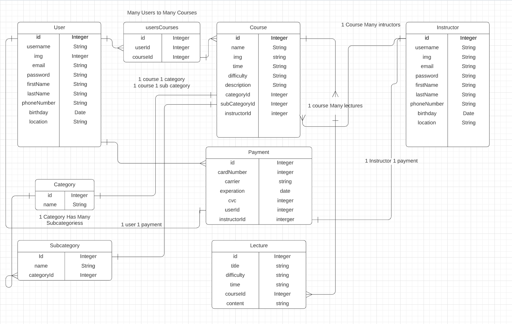

# Golden Path

An online marketplace app that fills the niche in creating a marketplace purely for profitable ideas, side-hustles, and knowledge that is all stored in one easily web application. 

## Purpose of this application

Golden Path is created to give entrepreneurs and teachers the ability to sell knowledge, trade secrets, data, and lessons on profitable ideas like Digital Arbitage, Dropshipping, Options trading, web developement courses or even accelerated online coding bootcamps. This application's target audience is anyone willing to purchase knowledge and learn at their convience. It also attempts to enlighten people to the multiple paths of knowledge and ideas to increase their monthly income. All courses and products on the site will be vetted to ensure quality and to expose scams and MLMs. Like many online marketplaces user reviews will tell a convincing story if a course is right for you. This is the GP guarentee. 

## Screenshots

## Models 

USERS
-------------------
PRIMARY KEY ID - INTEGER
username - STRING
firstName - STRING
lastName - STRING
emailAddress - STRING
password - STRING
profilePicture - STRING
Purchases - [] - STRING

SELLERS
-------------------
PRIMARY KEY ID - INTEGER
PRIMARY KEY ID - INTEGER
username - STRING
firstName - STRING
lastName - STRING
emailAddress - STRING
password - STRING
profilePicture - STRING
courseId - [] - INTEGER

COURSES
-------------------
PRIMARY KEY ID - INTEGER
name - STRING
content - STRING 
category - STRING
sellerId - INTEGER

REVIEWS
-------------------
PRIMARY KEY ID - INTEGER
userId - INTEGER
content - STRING
rating - INTEGER

COURSESREVIEWS
-------------------
PRIMARY KEY ID - INTEGER
courseId -
reviewId -

## USER STORIES
### As a user
- User signs up and creates a profile - later functionality will include figuring out the user's interest and tailoring courses for that user in the future. This is an extra option. 
- User searches for courses in the search bar
- Relevant keywords will populate the search page that either matches the input catagory or if the name or content summary includes searched keywords
- User reads summary of course, reviews, and decided if they want to take this course. 
- User bookmarks their course
- User will either be redirected to a new page with the course content, depending on how the lesson is set up.
- User begins their golden path to knowledge
- User reviews the course and takes the knowledge to become wealthy or for personal satisfaction.
### As a seller
- Instructor signs up
- Instructor can browse courses
- Instructor is still in development - plans to post courses are still in development  

## NOTES
Things to note 
- Original functionality has been decreased to meet project 2 deadline
- CRUD routes have been achieved - partial functionality of application
- working on alert error and success bug still
- future plans include properly setting up course addition
- restructuring course addition 
- Adding a more social media aspect into the app 

## CREDITS
- Application was created using bootstrap theme Code Geeks - licensing applicable 
- HOMEPAGE img - Christopher Austin Unsplash
- RESULTS img - Taneli Lahtinen Unsplash
- SINGLE COURSE img - Jaredd Craig Unsplash
- STUDENT DASHBOARD img - Gwendal Cottin Unsplash
- STUDENT PROFILE img - Jude Beck Unsplash
- STUDENT SIGNUP img - Tianshu Liu Unsplash
- STUDEN SIGNIN img - Pahala Basuki Unsplash
- INSTRUCTOR SIGNIN img - Alexandre Chambonpg Unsplash 
- INSTRUCTOR SIGNUP img - Psk Slayer Unsplash
- INSTRUCTOR DASH img - Joshua Rawson Harris Unsplash
- Multiple Local Strategies 
- https://mjvolk.com/implement-multiple-local-user-authentication-strategies-in-passport-js

